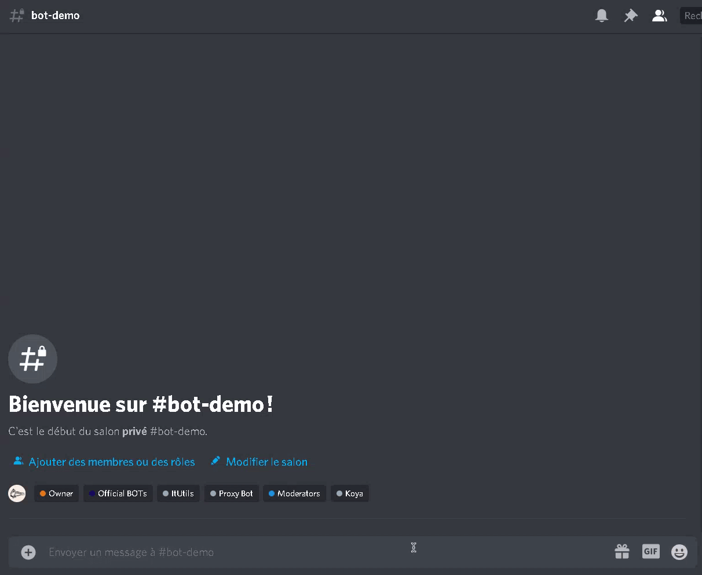

# itUtils
itUtils is a multi-function bot for discord, which can perform nmap scans, reverse dns, lookup dns, and more.

Originally created with <3 by [Ituriel](https://github.com/nulledituriel).

This is the original source code, make sure you follow the licence when you're using it.

# Useful links
Join the [support server](https://discord.gg/rX8mmXrQce) now!

Invite the official bot [here](https://discord.com/api/oauth2/authorize?client_id=809382260544372747&permissions=8&scope=bot) :) *Bot's prefix is `.`*

# Demo

# Usage
Before editing this source code, in order to follow GPL licence, make sure to fork it and mention that it is open source please.

**Requirements**
a) node.js
b) npm

**Usage**
1. clone this repository / download the files
2. run `npm i` to install necessary dependencies
3. edit `config.json` with your personnal details
4. run `node index.js` :)

# Issues and support
If you face any issue feel free to report it on github and join the support server!
